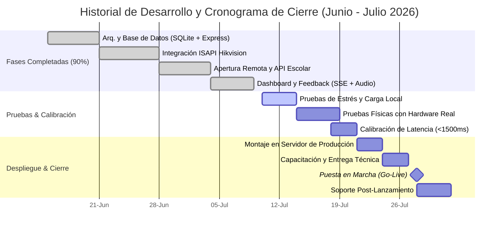

# Estatus del Desarrollo de Software HikVision - API Externa

Este documento presenta el informe de avances del proyecto **Sistema de Control de Accesos (Hikvision ISAPI + Express + SQLite)** y define el cronograma histórico y de cierre para las etapas de desarrollo, integración, pruebas, despliegue y puesta en marcha del sistema.

---

## 1. Resumen Ejecutivo

El desarrollo del software central del sistema de control de accesos se encuentra en una etapa avanzada de **madurez (90% de avance global)**. El núcleo lógico (servidor de eventos, base de datos SQLite local, interfaz administrativa, monitor de feedback visual en tiempo real y el módulo de llamadas HTTP Digest Auth para apertura remota de torniquetes) está **100% desarrollado y probado en entornos de simulación**.

El proyecto inició su desarrollo formal el **15 de Junio de 2026**. Con fecha de corte al **9 de Julio de 2026**, nos preparamos para iniciar la fase final del cronograma enfocada en las **pruebas físicas de campo con el hardware Hikvision**, la integración final de red local escolar y los ajustes de latencia de red para garantizar un tiempo de respuesta óptimo menor a **1.5 segundos**.

---

## 2. Matriz de Avance de Componentes

A continuación se detalla el estado actual de cada uno de los componentes de la solución:

| Módulo / Funcionalidad | Descripción | Estado | Avance |
| :--- | :--- | :---: | :---: |
| **Servidor Express (Núcleo)** | Configuración de servidor base, logging de peticiones y enrutamiento modular. | **Completado** | 100% |
| **Base de Datos SQLite3** | Tablas de usuarios, registro histórico de accesos y ajustes persistentes con seeders iniciales. | **Completado** | 100% |
| **Procesador de Eventos ISAPI** | Captura y parseo XML/JSON de eventos del lector, detección silenciosa de heartbeats. | **Completado** | 100% |
| **Integración de APIs Externas** | Cliente HTTP Axios para consulta en tiempo real a las APIs escolares con fallback de error. | **Completado** | 100% |
| **Digest Authentication Client** | Lógica de desafío-respuesta MD5 para enviar comandos remotos de apertura al dispositivo físico. | **Completado** | 100% |
| **Dashboard Administrativo** | CRUD de alumnos, visor en vivo de logs con SSE, panel de red y visualizador de códigos QR. | **Completado** | 100% |
| **Pantalla de Feedback Visual** | Interfaz minimalista para el alumno con sonidos interactivos (`AudioContext`) y modo Fullscreen. | **Completado** | 100% |
| **Simulador de Escaneos** | Consola de pruebas locales de credenciales sin requerir hardware físico conectado. | **Completado** | 100% |
| **Pruebas Físicas de Hardware** | Pruebas de cableado, compatibilidad de red y validación en directo con el lector de tarjetas. | *En Progreso* | 40% |
| **Despliegue y Puesta en Marcha** | Montaje en el servidor local definitivo de la escuela e integración de periféricos de pantalla. | *Pendiente* | 0% |

---

## Cronograma de Desarrollo, Integración y Cierre (Junio - Julio 2026)

Teniendo en cuenta la fecha actual (**9 de Julio de 2026**), el cronograma histórico y la proyección de cierre se estructuran de la siguiente manera:

### Detalle del Calendario de Actividades:

#### A. Fases de Desarrollo Realizadas (Histórico)

*   **Fase 1: Arquitectura y Base de Datos (15 - 20 de Junio de 2026) [COMPLETADA]**
    *   *Actividad*: Configuración del servidor central en Node.js/Express, inicialización de SQLite3 y creación del esquema relacional (`users`, `access_logs`, `settings`).
    *   *Entregable*: Estructura del proyecto ejecutable y persistencia de datos funcional.
*   **Fase 2: Integración ISAPI de Recepción de Eventos (21 - 27 de Junio de 2026) [COMPLETADA]**
    *   *Actividad*: Desarrollo del webhook receptor de Hikvision. Implementación de los parsers robustos basados en regex para `multipart/form-data` y descarte inteligente de latidos de vida (Heartbeats).
    *   *Entregable*: Captura exitosa del ID de la credencial en peticiones entrantes.
*   **Fase 3: Lógica de Apertura Remota y Conexión de API Escolar (28 de Junio - 3 de Julio de 2026) [COMPLETADA]**
    *   *Actividad*: Creación del cliente HTTP Digest Auth para mandar comandos XML de apertura. Conexión de Axios a las APIs externas de validación escolar.
    *   *Entregable*: Control de acceso lógico con decisión basada en consultas en tiempo real.
*   **Fase 4: Desarrollo de Interfaces de Control y Feedback (4 - 8 de Julio de 2026) [COMPLETADA]**
    *   *Actividad*: Diseño del Admin Dashboard (CRUD, Visor QR, ajustes) y el Monitor de Alumnos (`feedback.html`) usando Server-Sent Events (SSE) y alertas auditivas sintéticas.
    *   *Entregable*: Interfaces gráficas integradas de administración y visualización.

#### B. Fases de Cierre y Despliegue (Planificación Actual)

*   **Fase 5: Pruebas de Estrés y Carga Local (10 - 13 de Julio de 2026)**
    *   *Actividad*: Pruebas de carga del backend y base de datos simulando transacciones intensivas simultáneas de alumnos.
*   **Fase 6: Integración y Pruebas Físicas de Hardware (14 - 18 de Julio de 2026)**
    *   *Actividad*: Conexión del torniquete en entorno LAN de pruebas. Verificación de la apertura automática mediante el relé físico del lector al deslizar tarjetas.
*   **Fase 7: Calibración y Ajuste de Latencia (18 - 20 de Julio de 2026)**
    *   *Actividad*: Medición del flujo completo de red para garantizar un tiempo de respuesta menor a **1.2 segundos**, evitando el timeout preventivo del lector.
*   **Fase 8: Montaje en Servidor Local de Producción (21 - 23 de Julio de 2026)**
    *   *Actividad*: Configuración del PC servidor escolar definitivo (Node.js, PM2 para resiliencia a fallos de energía, SQLite) y fijación de la pantalla de confirmación.
*   **Fase 9: Capacitación al Personal y Entrega de Documentación (24 - 26 de Julio de 2026)**
    *   *Actividad*: Talleres prácticos para prefectura y administradores del panel.
*   **Fase 10: Arranque Oficial y Soporte (28 - 31 de Julio de 2026)**
    *   *Actividad*: **Puesta en marcha en vivo** Soporte presencial del equipo de ingeniería para solventar cualquier eventualidad en tiempo real.
---
## 5. Próximos Pasos

Para dar cumplimiento al cronograma, se sugieren las siguientes acciones inmediatas:
1.  **Revisión del Entorno de Red LAN**: Confirmar con el área de TI de la escuela la asignación de las IPs estáticas para el servidor y el lector Hikvision.
2.  **Preparación de Equipos**: Preparar el lector Hikvision físico para iniciar el montaje experimental a partir de mañana **10 de Julio**.
3.  **Configuración de Credenciales de Producción**: Solicitar al proveedor de la API escolar externa los tokens de acceso y las URLs finales de producción.
