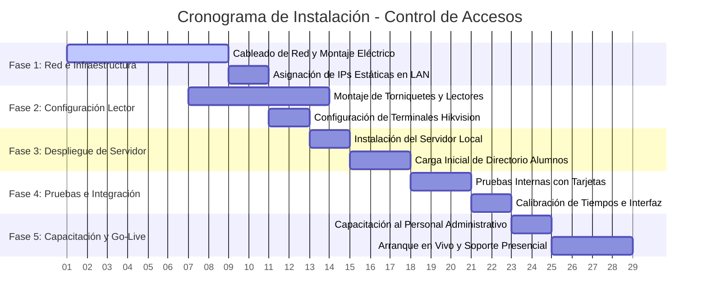

# Guía Administrativa: Requisitos e Instalación del Sistema de Control de Accesos

!!! Tip Esta guía está dirigida al personal administrativo, directores de proyecto y personal de soporte técnico encargados de la planeación, despliegue y mantenimiento del sistema de control de accesos para torniquetes escolares.

---

## 1. Requisitos para una Operación Óptima

Para garantizar que los alumnos ingresen de manera fluida y sin retrasos en las horas pico, la infraestructura debe cumplir con los siguientes estándares de red, hardware y desarrollo:

### A. Requisitos de Infraestructura de Red (LAN)
!!! abstract El hardware Hikvision y el servidor local se comunican constantemente. Es crucial garantizar estabilidad en la red interna:
*   **Direccionamiento IP Estático (Obligatorio)**:
    *   Tanto el servidor que corre el sistema (PC o Raspberry Pi) como los torniquetes físicos (lectores) deben tener asignadas **direcciones IP estáticas y fijas** en el router local. Si se cambia la IP por DHCP, el sistema perderá la conexión.
*   **Puertos de Red Abiertos (LAN)**:
    *   **Puerto 3000**: Debe estar abierto en el servidor local para recibir las lecturas de los torniquetes y servir las pantallas web.
    *   **Puerto 80** (o el configurado en la terminal): Debe estar abierto en el lector Hikvision para recibir comandos remotos de apertura de puerta.
*   **Conexión por Cable de Red (Ethernet)**:
    *   **No se recomienda el uso de Wi-Fi** para las terminales de acceso físico o el servidor, ya que la fluctuación de señal genera retrasos en la respuesta de apertura. Toda la instalación debe realizarse mediante cableado estructurado Cat6.

### B. Requisitos del Servidor Local (Hardware)
El software está altamente optimizado y no requiere servidores de gama alta. Puede ejecutarse en:
*   **Servidor Local Dedicado o PC de Soporte**:
    *   Sistema Operativo: Windows 10/11, Linux (Ubuntu, Debian) o macOS.
    *   Procesador: Intel Core i3 (o equivalente) en adelante.
    *   Memoria RAM: 4 GB o superior.
    *   Espacio en Disco: 10 GB disponibles (la base de datos SQLite crece de manera muy lenta; 100,000 registros ocupan menos de 50 MB).
*   **Microcomputadoras**:
    *   Compatible con Raspberry Pi 4 (de 2GB o 4GB de RAM) corriendo Linux. Es una excelente opción de bajo consumo eléctrico para operar 24/7.

### C. Requisitos de la API Externa de Asistencia (Sistemas Escolares)
La API externa (del portal escolar o administrativo que valida a los alumnos) es la que dictamina si se abre o no el torniquete. Debe cumplir con:
*   **Tiempo de Respuesta**:
    *   La API escolar debe responder la consulta de verificación de asistencia en **menos de 800 milisegundos**.
* !!! warning Si la API tarda más de 1.5 segundos (1500ms), el torniquete físico entrará en "timeout" y le denegará el acceso al alumno de manera preventiva por seguridad.
*   **Protocolo Seguro**: Conexión HTTPS estable para resguardar la privacidad de los ID de los alumnos en tránsito.
*   **Formato de Respuesta**: Debe responder en formato JSON estructurado, retornando códigos HTTP adecuados (ej. `200 OK` para alumnos autorizados, y códigos de error con el formato `{"message": "Motivo del rechazo"}` para alumnos bloqueados o fuera de horario).

### D. Pantalla de Retroalimentación (Feedback)
*   Una Smart TV, tablet o monitor de PC ubicado al lado del torniquete físico.
*   Debe contar con un navegador moderno (Google Chrome o Microsoft Edge recomendado) abierto en la URL: `http://<IP_DEL_SERVIDOR>:3000/feedback.html` en modo pantalla completa.
*   Es importante activar el sonido del navegador en esa ventana para que el alumno escuche los timbres de validación (*Tono agudo = Pase*, *Tono grave = Bloqueado*).

---

## 2. Cronograma de Actividades para la Instalación

El despliegue exitoso del sistema se divide en **5 fases estructuradas** a lo largo de un calendario comprimido de **4 semanas (28 días)**. Para lograr este plazo, se ejecutan de manera paralela las tareas de obra civil/cableado y el montaje de los equipos de control de accesos.

### Detalle de Fases de Trabajo:

#### Fase 1: Preparación de Red e Infraestructura (Semana 1)
*   **Instalación Eléctrica**: Canalización e instalación de tomas de corriente regulada en las bahías de acceso para alimentar los torniquetes.
*   **Cableado Estructurado**: Tendido de cables de red Cat6 desde el switch principal hasta la ubicación física de cada torniquete y la pantalla de feedback.
*   **Aseguramiento de Red**: Configuración del router escolar para reservar las direcciones IP estáticas fijas de los dispositivos.

#### Fase 2: Montaje de Hardware y Configuración de Terminales (Semanas 1-2)
*   **Montaje Físico**: Fijación de los torniquetes al piso y montaje de los soportes para los lectores Hikvision (se realiza en paralelo con el cableado para optimizar el tiempo).
*   **Configuración del Firmware**:
    *   Ingreso al portal web del lector Hikvision.
    *   Habilitar el modo de **Verificación Remota** (Remote Verification).
    *   Configurar la IP del Servidor local como el **Alarm Host / Security Center** en el puerto `3000`.

#### Fase 3: Despliegue del Servidor y Base de Datos (Semana 2)
*   **Montaje de Software**: Instalación de Node.js en la computadora asignada como servidor local y clonación del software de control.
*   **Migración de Datos**: Importación inicial de los códigos de credenciales (tarjetas, códigos) de los alumnos y asociación de sus nombres en la tabla `users`.
*   **Alineación de APIs**: Integración de las URLs de validación externa proporcionadas por el equipo de desarrollo de sistemas escolares.

#### Fase 4: Pruebas Integradas y Calibración (Semana 3)
*   **Pruebas de Esfuerzo**: Simulación masiva de tránsitos en el simulador del dashboard administrativo para verificar la velocidad de la base de datos y la capacidad de la red.
*   **Pruebas Físicas**: Testeo de tarjetas registradas y no registradas directamente en los lectores instalados.
*   **Ajuste Fino**: Calibración de la pantalla de feedback (pantalla completa, habilitación del sonido, ajuste visual de textos y visualización del historial en tiempo real).

#### Fase 5: Capacitación al Personal y Puesta en Marcha (Semana 4)
*   **Capacitación**: Taller práctico para el personal administrativo y de prefectura sobre el uso del dashboard, altas/bajas de usuarios, consulta de registros históricos y generación de códigos QR de emergencia.
*   **Arranque**: Apertura oficial de los accesos con soporte técnico presencial durante las primeras horas de entrada escolar para resolver dudas o incidencias operativas.

---

## 3. Recomendaciones de Seguridad y Mantenimiento

*   **Copias de Seguridad (Backups)**:
    Se recomienda copiar el archivo `database.sqlite` (ubicado en la raíz del proyecto) de manera semanal. Este archivo contiene toda la configuración y el directorio de usuarios. En caso de falla eléctrica del servidor, basta con pegar esta copia en un nuevo servidor para restaurar la operación en 5 minutos.
