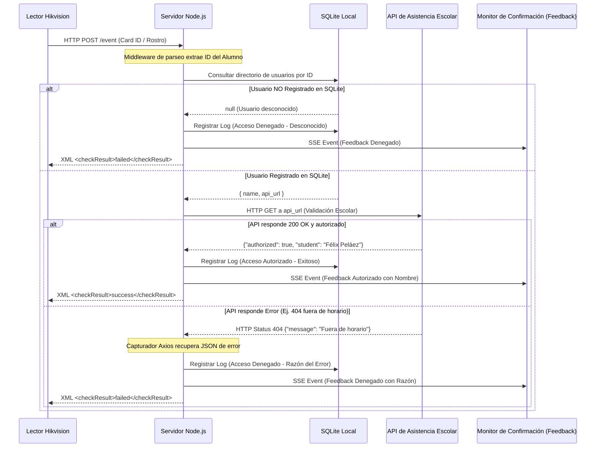

# Sistema de Control de Accesos (Hikvision ISAPI + Express + SQLite)
Este proyecto es un servidor de control de accesos desarrollado sobre **Node.js (Express)** y **SQLite3**, diseñado para integrar terminales físicas de control de acceso **Hikvision** (lectores de tarjetas, reconocimiento facial y huellas dactilares) con sistemas externos mediante validaciones de APIs en tiempo real.

## 1. Arquitectura General del Sistema

El sistema implementa una arquitectura modular (patrón MVC/Routing) que separa la lógica de datos, controladores, enrutadores y utilidades de red:

```bash
Sistema_Acceso/
├── config/
│   └── database.js      # Inicialización de tablas y consultas CRUD en SQLite3
├── controllers/
│   ├── accessController.js   # Procesamiento de eventos, simulaciones y mocks de pruebas
│   ├── authController.js     # Autenticación y gestión de sesiones de administración
│   ├── userController.js     # Operaciones CRUD para el directorio de alumnos
│   └── settingsController.js # Lectura/escritura de ajustes y comandos remotos
├── middleware/
│   ├── auth.js          # Middleware de seguridad (Cookie-Session Check)
│   └── bodyParsers.js   # Procesador de peticiones (JSON, urlencoded, raw text y XML)
├── routes/
│   ├── api.js           # Endpoints administrativos expuestos bajo /api/...
│   └── device.js        # Enrutamiento de eventos ISAPI del hardware Hikvision
├── utils/
│   ├── device.js        # Cliente HTTP Digest Auth para comandos remotos ISAPI (Apertura)
│   └── logger.js        # Utilidad de logs por consola y transmisión en tiempo real via SSE
├── public/              # Interfaz gráfica del panel (HTML, CSS y JS)
│   ├── index.html       # Dashboard de administración
│   ├── feedback.html    # Pantalla minimalista de confirmación visual para alumnos
│   ├── login.html       # Pantalla de inicio de sesión administrativo
│   ├── app.js           # JavaScript del cliente administrativo
│   └── style.css        # Estilos visuales optimizados (Glassmorphic Dark Mode)
```
```bash
├── db.js                # Wrapper legado para compatibilidad con código antiguo
├── device.js            # Wrapper legado para compatibilidad con código antiguo
├── database.sqlite      # Base de datos local autogenerada
├── package.json         # Declaración de dependencias y scripts npm
└── server.js            # Punto de arranque y cargador de módulos
```
---

## 2. Base de Datos Local y Modelos (SQLite)

El sistema utiliza **SQLite3** local por su velocidad de lectura y auto-suficiencia. Cuenta con tres tablas principales configuradas en [config/database.js]

| Columna   | Tipo      | Restricciones                        | Descripción                                                                 |
|-----------|-----------|--------------------------------------|-----------------------------------------------------------------------------|
| `id`      | INTEGER   | PRIMARY KEY, AUTOINCREMENT           | ID auto-incremental de la tabla                                            |
| `user_id` | TEXT      | UNIQUE, NOT NULL                     | ID lógico de la credencial (tarjeta, código de barras o ID facial)         |
| `name`    | TEXT      | NOT NULL                             | Nombre completo del alumno                                                 |
| `api_url` | TEXT      | NULLABLE                             | Dirección API específica para validar al usuario (canalización a distintos servidores) |

### B. Tabla `access_logs` (Historial de Accesos)
Almacena la bitácora histórica de todos los intentos de acceso.

| Columna         | Tipo      | Restricciones                        | Descripción                                                                 |
|-----------------|-----------|--------------------------------------|-----------------------------------------------------------------------------|
| `id`            | INTEGER   | PRIMARY KEY, AUTOINCREMENT           | ID auto-incremental del registro                                           |
| `timestamp`     | DATETIME  | DEFAULT CURRENT_TIMESTAMP            | Fecha y hora del registro                                                  |
| `user_id`       | TEXT      | NOT NULL                             | ID de la tarjeta/rostro consultado                                         |
| `name`          | TEXT      | NOT NULL                             | Nombre del alumno o indicador de estado local (ej. "Desconocido")          |
| `event_type`    | TEXT      | NOT NULL                             | Origen o tipo de evento (`card`, `face`, `simulated_scan`, `remote_open`)  |
| `api_url`       | TEXT      | NULLABLE                             | API que fue consultada para validar el acceso                              |
| `api_response`  | TEXT      | NULLABLE                             | Respuesta JSON cruda de la API externa o descripción de error HTTP         |
| `authorized`    | INTEGER   | NOT NULL                             | Estado de autorización (`1` = Aprobado, `0` = Denegado)                    |
| `door_opened`   | INTEGER   | NOT NULL                             | Indica si el comando de apertura remota (`PUT`) fue ejecutado exitosamente |

### C. Tabla `settings` (Configuración de Red y Dispositivo)
Almacena variables de entorno clave como pares clave-valor.
*   `device_ip`: Dirección IPv4 de la terminal Hikvision en la red LAN.
*   `device_port`: Puerto de red ISAPI (por defecto `80`).
*   `device_user`: Usuario administrativo del dispositivo (habitualmente `admin`).
*   `device_password`: Contraseña del hardware (utilizada para Digest Auth).
*   `device_door_channel`: Canal de la puerta física a comandar (habitualmente `1`).
*   `enable_device_api_open`: Bandera booleana (`true`/`false`) para forzar un comando HTTP PUT remoto por parte del servidor.
*   `admin_password`: Contraseña de acceso al Panel Administrativo web (por defecto `admin123`).

---

## 3. Protocolo de Integración Hikvision ISAPI

!!! info El servidor se comunica con las terminales Hikvision utilizando su API basada en HTTP llamada **ISAPI** (Intelligent Security API).

### A. Recepción de Eventos de Verificación Remota (Webhook)
Cuando un usuario presenta una tarjeta o rostro en el lector, la terminal actúa en modo de **Verificación Remota** (si está configurada así) enviando una petición HTTP POST a nuestro servidor. El servidor captura estas peticiones en las rutas montadas en [routes/device.js] (`/`, `/event`, `/remoteCheck`, `/ISAPI/AccessControl/remoteCheck`).

#### Peticiones Multipart y Heartbeats
*   El lector envía datos estructurados en XML o JSON. A menudo se transmiten como cuerpos **multipart/form-data** acompañados de imágenes del rostro.
*   Para garantizar la compatibilidad ante cualquier problema de parsing de librerías en Express, implementamos un extractor regex de respaldo sobre la variable `req.rawBody` en [controllers/accessController.js]
    *   Extrae el ID usando la expresión: `/<employeeNoString[^>]*>([^<]+)<\/employeeNoString>/`.
    *   Extrae el número de tarjeta usando: `/<cardNo[^>]*>([^<]+)<\/cardNo>/`.
*   El lector suele enviar peticiones periódicas de **Heartbeat** (Latidos de vida) estructuradas en MIME boundaries para verificar si el servidor está en línea:
    ```xml
    --MIME_boundary
    Content-Disposition: form-data; name="AccessControllerEvent"
    Content-Type: application/json
    ...
    { "eventType": "heartBeat", "eventDescription": "heartBeat" }
    ```
    !!! tip El servidor detecta esta cadena en el cuerpo de la solicitud de forma silenciosa y responde con un código de éxito para no saturar los registros:
    ```xml
    <?xml version="1.0" encoding="UTF-8"?>
    <ResponseStatus version="2.0" xmlns="http://www.isapi.org/ver20/XMLSchema">
        <requestURL>/</requestURL>
        <statusCode>1</statusCode>
        <statusString>OK</statusString>
        <subStatusCode>ok</subStatusCode>
    </ResponseStatus>
    ```

#### Respuesta de Verificación de Acceso
!!! warning El servidor debe devolver una respuesta inmediata en menos de **1.5 segundos** (1500ms) para evitar timeouts en la terminal física. Dependiendo de la cabecera aceptada, devuelve JSON o XML. El formato estándar en XML es:
```xml
<?xml version="1.0" encoding="UTF-8"?>
<RemoteCheck version="2.0" xmlns="http://www.isapi.org/ver20/XMLSchema">
    <serialNo>82</serialNo>
    <checkResult>success</checkResult> <!-- "success" para abrir, "failed" para denegar -->
</RemoteCheck>
```
!!! Nota: Si la respuesta es `success`, el lector de Hikvision se encarga automáticamente de liberar su relé físico local.

### B. Comando de Apertura Forzada por API (Digest Authentication)
Si un administrador pulsa el botón *"Enviar Comando de Apertura"* en el panel web, el servidor envía una petición HTTP PUT al lector al endpoint:
`PUT http://<IP_LECTOR>:<PUERTO>/ISAPI/AccessControl/RemoteControl/door/1`

Cuerpo XML enviado:
```xml
<?xml version="1.0" encoding="UTF-8"?>
<RemoteControlDoor version="2.0" xmlns="http://www.hikvision.com/ver20/XMLSchema">
    <cmd>open</cmd>
</RemoteControlDoor>
```

#### Flujo del Protocolo de Desafío/Respuesta Digest:
Las terminales Hikvision protegen sus APIs usando Digest Authentication. El helper en [utils/device.js] lo gestiona así:
1.  **Paso 1 (Desafío)**: El servidor envía el `PUT` sin autenticar. El lector responde con `401 Unauthorized` y una cabecera `WWW-Authenticate` conteniendo `realm`, `nonce`, y `qop`.
2.  **Paso 2 (Cálculo de Hashes MD5)**:
    *   $HA1 = \text{MD5}(\text{usuario} : \text{realm} : \text{contraseña})$
    *   $HA2 = \text{MD5}(\text{método PUT} : \text{URI})$
    *   $\text{cnonce} = \text{Cadena aleatoria del cliente}$
    *   $\text{response} = \text{MD5}(HA1 : \text{nonce} : \text{nc} : \text{cnonce} : \text{qop} : HA2)$
3.  **Paso 3 (Re-intento)**: El servidor repite la petición `PUT` enviando la cabecera calculada:
    `Authorization: Digest username="admin", realm="...", nonce="...", uri="...", response="..."`
4.  **Paso 4**: El hardware valida la firma y abre el torniquete físico.

---

## 4. Flujo de Validación Híbrido en Tiempo Real

El ciclo de procesamiento completo para una tarjeta deslizada en el torniquete sigue este diagrama de flujo:



---

## 5. Interfaces y Paneles de Control

El sistema cuenta con dos visualizaciones web diseñadas en HSL oscuro (Glassmorphic) y responsivo:

### A. Dashboard de Administración (`index.html` en puerto 3000)
!!! success Es la consola de administración protegida por credenciales. Contiene:
*   **Métricas de Acceso**: Tarjetas procesadas hoy, accesos exitosos y accesos denegados, actualizándose al instante.
*   **Consola en Vivo**: Transmisión de depuración en tiempo real del backend usando un log de color (azul para información, verde para éxitos, rojo para errores).
*   **Directorio de Usuarios (Alumnos)**: Panel CRUD para registrar nuevos alumnos y asignarles su endpoint API individual.
*   **Código QR de Usuario**: Cada fila de la tabla de usuarios posee un botón con icono QR. Al hacer clic, despliega un modal centrado con el código QR del ID del usuario (generado usando la API pública `api.qrserver.com`), su nombre y un botón de cierre fácil.
*   **Configuración del Dispositivo**: Ajustes de red del torniquete y la opción de modificar la contraseña de administración del panel.
*   **Historial de Accesos Recientes (Full-Width)**: Tabla de ancho completo al pie del panel que muestra de forma cómoda las columnas críticas (*Fecha/Hora, Usuario, Tipo, API URL y Respuesta*).

### B. Monitor de Confirmación Visual (`feedback.html` en puerto 3000)
!!! success Es una pantalla ultra-minimalista optimizada para monitores auxiliares o tablets ubicadas en el torniquete.
*   **Modo Standby**: Muestra el icono de escaneo animado en bucle con el texto *"Presente su Credencial"*.
*   **Modo Autorizado**: Pantalla verde con un checkmark gigante y el nombre del alumno.
*   **Modo Denegado**: Pantalla roja con un candado y el motivo exacto de la denegación (ej: *"Fuera de horario o alumno sin grupo"*).
*   **Alertas Sonoras**: Utiliza la API de audio web nativa del navegador (`AudioContext`) para generar notas musicales sintéticas de retroalimentación inmediata (acorde brillante agudo en C5-E5 para éxito; nota de alerta en G2-Ab2 para error).
*   **Botón Pantalla Completa**: En la esquina superior derecha cuenta con un botón flotante traslúcido de Pantalla Completa que expande u oculta la ventana usando la API de Pantalla Completa del navegador.
*   **Comunicación en Tiempo Real**: Escucha eventos en segundo plano usando un canal de Server-Sent Events (SSE) `/api/logs-stream` que corre sin autenticación para facilitar la instalación del monitor sin login.

<div style="page-break-after: always;"></div>

## 6. Configuración y Puesta en Marcha

### Prerrequisitos
*   Node.js (versión 16 o superior).
*   NPM (instalado con Node).

### Instalar dependencias
```bash
npm install
```

### Iniciar el servidor
```bash
# Iniciar en modo producción
npm start

# Iniciar en modo desarrollo con recarga automática (nodemon)
npm run dev
```

El panel administrativo estará disponible en: [http://localhost:3000](http://localhost:3000)  
La pantalla de feedback visual estará disponible en: [http://localhost:3000/feedback.html](http://localhost:3000/feedback.html)
